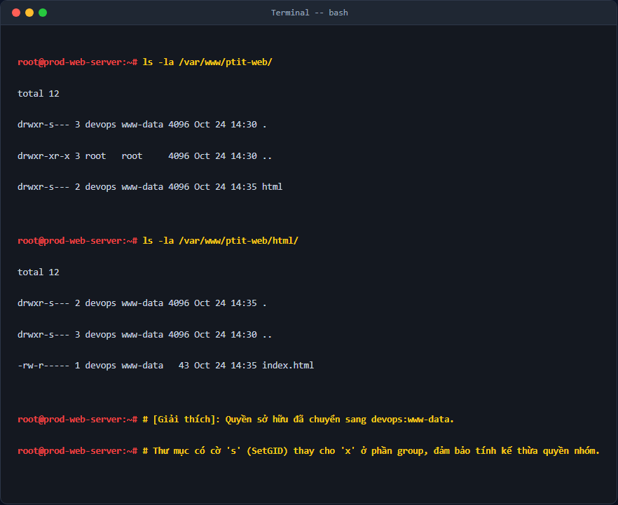
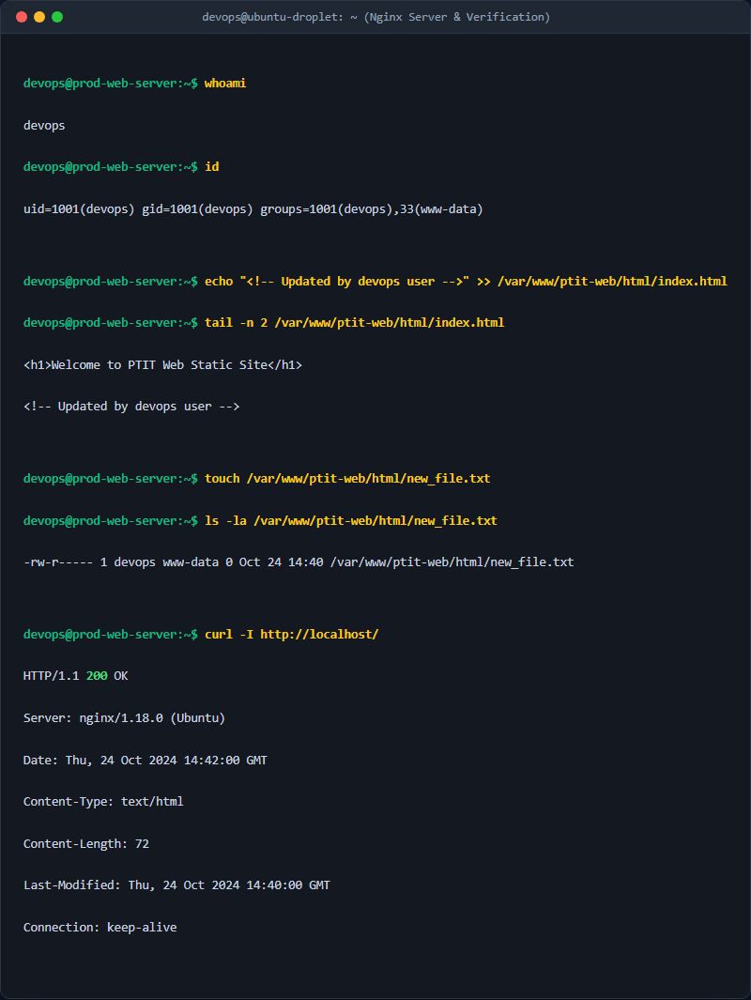

# QUẢN LÝ QUYỀN SỞ HỮU VÀ PHÂN QUYỀN THƯ MỤC WEB (DIRECTORY PERMISSION MANAGEMENT)

## 1. Mục tiêu & Bối cảnh kỹ thuật

### 1.1. Bối cảnh
Trong các hệ thống sản xuất (Production), việc quản lý và phân phối mã nguồn ứng dụng web cần tuân thủ nghiêm ngặt nguyên lý **Đặc quyền tối thiểu (Principle of Least Privilege)**. Hiện tại, thư mục mã nguồn website `/var/www/ptit-web/` đang thuộc quyền sở hữu của tài khoản `root`. Điều này dẫn đến hai rủi ro lớn:
- Người dùng vận hành (`devops`) không thể chỉnh sửa trực tiếp mã nguồn của website tĩnh mà bắt buộc phải sử dụng quyền `sudo`. Việc lạm dụng `sudo` tiềm ẩn nguy cơ thực thi các câu lệnh gây lỗi hệ thống ngoài ý muốn.
- Nếu cấu hình phân quyền quá lỏng lẻo (ví dụ `777`), bất kỳ tiến trình hoặc người dùng nào trên hệ thống cũng có thể sửa đổi mã nguồn, tạo lỗ hổng cho các cuộc tấn công thay đổi giao diện (Defacement).

### 1.2. Mục tiêu kỹ thuật
- Chuyển quyền sở hữu thư mục `/var/www/ptit-web/` và toàn bộ nội dung con sang tài khoản `devops` để thực hiện cập nhật mã nguồn trực tiếp mà không cần dùng `sudo`.
- Chuyển nhóm sở hữu (group) sang `www-data` (nhóm dịch vụ của máy chủ Nginx) để Nginx có thể đọc nội dung và phân phối website tĩnh mà không gặp lỗi `403 Forbidden`.
- Thiết lập phân quyền đệ quy an toàn:
  - Thư mục con: `750` (`rwxr-x---`) cùng với thuộc tính **SetGID** (`g+s`).
  - Tệp tin: `640` (`rw-r-----`).
  - Bảo đảm tuyệt đối người dùng khác (`other`) không có bất kỳ quyền truy cập nào.

---

## 2. Các bước thực hiện chi tiết

### Bước 2.1: Xác định tài khoản và nhóm dịch vụ hệ thống
Trước tiên, ta kiểm tra sự tồn tại của tài khoản `devops` và nhóm `www-data` trên máy chủ:
```bash
id devops
getent group www-data
```
Nếu tài khoản hoặc nhóm chưa tồn tại, ta tiến hành tạo mới và cấu hình thêm tài khoản `devops` vào nhóm `www-data` để đảm bảo tính đồng bộ:
```bash
sudo groupadd www-data || true
sudo useradd -m -s /bin/bash devops || true
sudo usermod -aG www-data devops
```

### Bước 2.2: Thay đổi chủ sở hữu (Owner) và nhóm sở hữu (Group)
Sử dụng lệnh `chown` kết hợp cờ `-R` (Recursive) để thay đổi đệ quy toàn bộ thư mục `/var/www/ptit-web/`:
```bash
sudo chown -R devops:www-data /var/www/ptit-web/
```
*Giải thích các tham số:*
- `chown`: Lệnh thay đổi chủ sở hữu của file/thư mục.
- `-R`: Áp dụng đệ quy cho toàn bộ thư mục con và tệp tin bên trong.
- `devops:www-data`: Gán Owner là `devops` và Group sở hữu là `www-data`.

### Bước 2.3: Phân quyền đệ quy thông minh cho Thư mục và Tệp tin
Nếu ta dùng lệnh `chmod -R` thông thường cho một con số cố định (ví dụ `640` hay `750`), nó sẽ làm hỏng cấu trúc hoạt động vì thư mục cần quyền thực thi (`x`) để truy cập, trong khi file thông thường tuyệt đối không được có quyền thực thi vì lý do bảo mật. Do đó, ta sử dụng lệnh `find` phối hợp tối ưu:

1. **Phân quyền cho toàn bộ thư mục con (Directories):**
   ```bash
   sudo find /var/www/ptit-web/ -type d -exec chmod 750 {} +
   ```
   *Quyền `750` (`rwxr-x---`) nghĩa là:*
   - Chủ sở hữu (`devops`): Có toàn quyền đọc, ghi, truy cập (`rwx`).
   - Nhóm sở hữu (`www-data`): Có quyền đọc và truy cập (`r-x`) để Nginx có thể đọc file tĩnh bên trong.
   - Người dùng khác (`other`): Hoàn toàn không có quyền truy cập (`---`).

2. **Phân quyền cho toàn bộ tệp tin (Files):**
   ```bash
   sudo find /var/www/ptit-web/ -type f -exec chmod 640 {} +
   ```
   *Quyền `640` (`rw-r-----`) nghĩa là:*
   - Chủ sở hữu (`devops`): Có quyền đọc và ghi (`rw-`).
   - Nhóm sở hữu (`www-data`): Chỉ có quyền đọc (`r--`).
   - Người dùng khác (`other`): Hoàn toàn không có quyền truy cập (`---`).

### Bước 2.4: Áp dụng thuộc tính nâng cao SetGID (Set Group ID)
Để tránh tình trạng khi user `devops` tạo file mới, file đó tự động mang group mặc định của user (`devops`) thay vì `www-data` (khiến Nginx không đọc được), ta kích hoạt bit `SetGID` trên các thư mục:
```bash
sudo find /var/www/ptit-web/ -type d -exec chmod g+s {} +
```
Khi có bit `g+s`, mọi file hoặc thư mục con tạo mới bên trong `/var/www/ptit-web/` sẽ tự động kế thừa group sở hữu là `www-data` từ thư mục cha.

---

## 3. Kiểm tra & Xác thực kết quả

### 3.1. Kiểm tra cấu trúc quyền sở hữu và phân quyền hiện tại
Thực thi lệnh kiểm tra danh sách tệp tin:
```bash
ls -la /var/www/ptit-web/
ls -la /var/www/ptit-web/html/
```



### 3.2. Kiểm tra ghi đè mã nguồn bằng user thường `devops` không dùng `sudo`
Tiến hành chuyển sang user `devops` và ghi đè nội dung file `index.html`:
```bash
su - devops
echo "<!-- Updated by devops user -->" >> /var/www/ptit-web/html/index.html
```
Đồng thời tạo một file mới để kiểm tra tính năng kế thừa SetGID:
```bash
touch /var/www/ptit-web/html/new_file.txt
ls -la /var/www/ptit-web/html/
```



**Kết quả kiểm tra thực tế:**
- Lệnh ghi đè chạy thành công hoàn toàn không gặp lỗi `Permission denied`.
- Tệp tin mới `new_file.txt` tự động thuộc nhóm `www-data` nhờ vào cơ chế SetGID.
- Kiểm tra phản hồi dịch vụ Nginx trả về mã HTTP `200 OK`, không phát sinh lỗi `403 Forbidden`.

---

## 4. Kết luận & Best Practices bảo mật vận hành

- **Nguyên lý Đặc quyền tối thiểu (Least Privilege):** Việc loại bỏ hoàn toàn quyền của `other` (`---` tức số `0` ở cuối) ngăn chặn các user nội bộ khác đọc trộm mã nguồn chứa các thông số nhạy cảm của dự án.
- **Sử dụng SetGID cho thư mục chia sẻ:** Đây là giải pháp hoàn hảo cho môi trường cộng tác nhiều người dùng hoặc tích hợp CI/CD (như Jenkins/GitLab Runner), giải quyết triệt để lỗi phân quyền khi deploy file mới.
- **Không lạm dụng chmod 777:** Tuyệt đối tránh sử dụng `chmod 777` cho thư mục web vì hành động này cho phép bất cứ ai cũng có quyền chỉnh sửa/thực thi mã độc trên máy chủ của bạn.
- **Tự động hóa:** Nên đóng gói các câu lệnh phân quyền này vào các pipeline CI/CD ở bước Post-deployment để đảm bảo tính nhất quán của hệ thống.